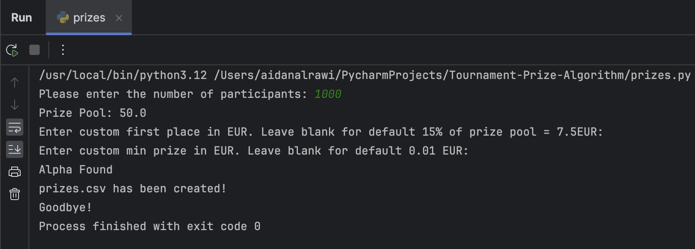
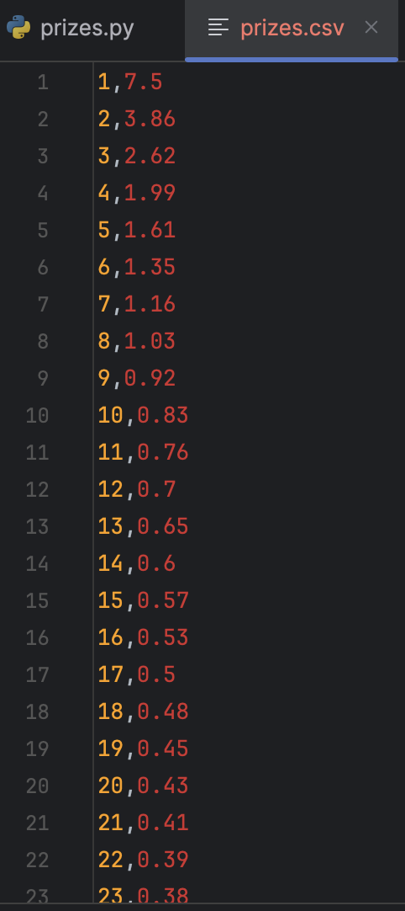

# Algorithm To Calculate Prize Structure For Tournaments(i.e. poker, lottery etc.)

This is a program that I designed for the mobile app Winerz,
they required an algorithm to calculate the payout structure for in-app tournaments.
This program utilizes the methodology put forth in the paper at https://arxiv.org/pdf/1601.04203.pdf.
Utilizing this power law method allows us to create the ideal incentive structure for tournaments.
Please feel free to use this program to generate payouts for poker tournaments, games etc.

## Use instructions:
  1. Enter the number of participants
  2. Prize pool = 5% of participants EUR
  3. Customise top prize
  4. Customise min prize
  5. Payouts returned as .csv file

## User Example JPG:

## Output Example JPG:

